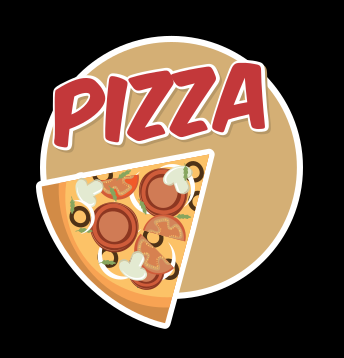
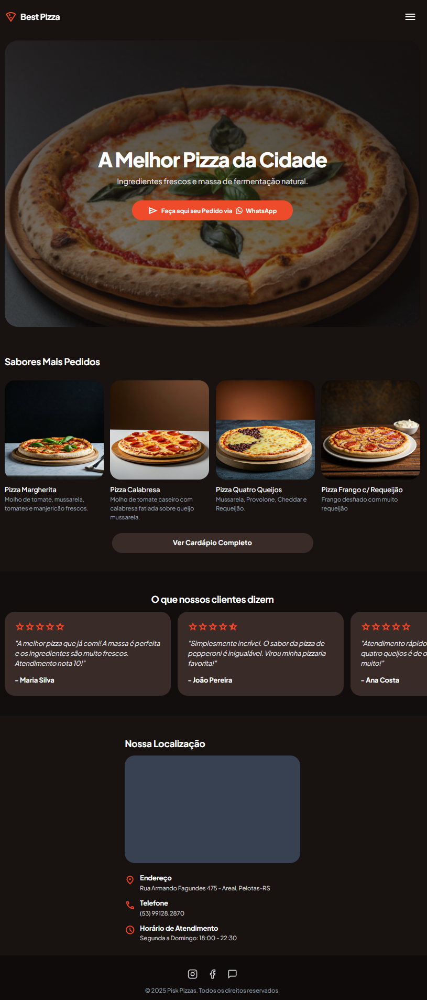
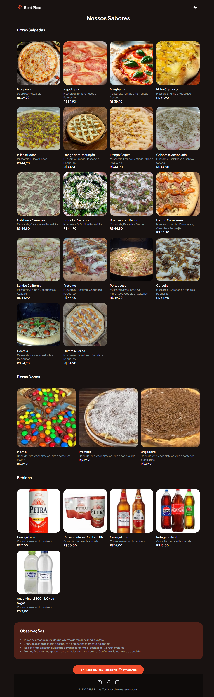

# 🍕 Landing Page - Best Pizza

<p align="center">
  
</p>

Uma landing page moderna e responsiva desenvolvida para a Best Pizza (Pisk Pizzas), com design elegante, cardápio completo e integração direta com WhatsApp.

## ✨ Características

- 🎨 **Design Moderno**: Interface dark com paleta de cores vibrante e profissional
- 📱 **Totalmente Responsivo**: Layout adaptativo usando Tailwind CSS e CSS Grid
- 🍕 **Cardápio Completo**: Exibição de pizzas salgadas, doces e bebidas com imagens
- 📲 **Integração WhatsApp**: Link direto para pedidos via WhatsApp
- 🗺️ **Localização**: Mapa integrado do Google Maps
- ⭐ **Depoimentos**: Seção com avaliações de clientes
- 🎯 **Material Icons**: Ícones modernos do Google Material Symbols
- 🤖 **Chatbot**: Integração com Botpress para atendimento automatizado

## 📁 Estrutura do Projeto

```
Pizza/
├── index.html              # Página principal (home)
├── cardapio.html          # Página do cardápio completo
├── style.css              # Estilos CSS customizados
├── teste.js               # Scripts JavaScript
├── itens.csv              # Base de dados dos itens do cardápio
├── itens.txt              # Lista de itens em texto
├── package.json           # Dependências do projeto
├── package-lock.json      # Lock de dependências
├── treino.txt             # Arquivo auxiliar
├── README.md              # Este arquivo
└── images/                # Pasta com todas as imagens
    ├── pizza-logo.svg     # Logo da marca
    ├── pizza-ico.svg      # Ícone de pizza
    ├── logo-white.jpg     # Logo branca
    ├── logo-white.webp    # Logo branca (WebP)
    ├── whats.svg          # Ícone do WhatsApp
    ├── mussarela.jpg      # Imagens das pizzas
    ├── napolitana.jpeg
    ├── margherita.jpg
    ├── 4queijos.jpeg
    └── ...                # Demais imagens do cardápio
```

## 🛠️ Tecnologias Utilizadas

- **HTML5**: Estrutura semântica
- **CSS3**: Estilos customizados
- **Tailwind CSS**: Framework CSS utility-first via CDN
- **JavaScript**: Interatividade e funcionalidades
- **Google Material Symbols**: Ícones vetoriais
- **Google Maps API**: Integração de mapas
- **Botpress**: Chatbot para atendimento
- **Node.js**: Gerenciamento de dependências
- **CSV Parser**: Processamento de dados do cardápio

## 📋 Seções da Landing Page

### Página Principal (index.html)

| Seção | Descrição |
|-------|-----------|
| **Header** | Logo e menu de navegação fixo |
| **Hero Section** | Banner principal com call-to-action para WhatsApp |
| **Sabores Mais Pedidos** | Grid com as 4 pizzas mais populares |
| **Depoimentos** | Carrossel com avaliações de clientes |
| **Localização** | Mapa e informações de contato |
| **Footer** | Redes sociais e copyright |

<p align="center">
  
</p>

### Página do Cardápio (cardapio.html)

| Categoria | Quantidade | Faixa de Preço |
|-----------|------------|----------------|
| Pizzas Salgadas | 18 sabores | R$ 39,90 - R$ 54,90 |
| Pizzas Doces | 3 sabores | R$ 39,90 |
| Bebidas | 5 opções | R$ 3,00 - R$ 30,00 |

<p align="center">
  
</p>

## 🎨 Paleta de Cores

```css
--primary: #ee4b2b           /* Vermelho - cor principal */
--background-light: #f8f6f6  /* Cinza claro - fundo modo claro */
--background-dark: #181211   /* Preto - fundo modo escuro */
--text-white: #ffffff        /* Branco - texto principal */
--text-gray: #9ca3af         /* Cinza - texto secundário */
```

## 📱 Layout Responsivo

A página utiliza um design mobile-first com breakpoints:

- **Mobile**: Layout em coluna única, cards adaptáveis
- **Tablet/Desktop (768px+)**: Grid de múltiplas colunas, largura máxima de 1024px centralizada

## 🚀 Como Usar

### Clone ou baixe o repositório

```bash
git clone https://github.com/seu-usuario/best-pizza.git
cd best-pizza
```

### Instale as dependências (opcional)

```bash
npm install
```

### Abra no navegador

Opção 1: Abra o arquivo `index.html` diretamente no seu navegador

Opção 2: Utilize a extensão "Live Server" do VS Code
- Clique com o botão direito no arquivo `index.html`
- Selecione "Open with Live Server"

### Acesse em seu navegador

```
http://localhost:5500
```

Se utilizar o Live Server, a página será aberta automaticamente.

## 📝 Notas de Desenvolvimento

- O cardápio é gerenciado através do arquivo `itens.csv` para fácil atualização
- As imagens estão otimizadas em JPEG/PNG para melhor performance
- O design utiliza Tailwind CSS via CDN para desenvolvimento rápido
- Integração com Google Maps API para exibição da localização
- Chatbot Botpress integrado para atendimento automatizado
- Layout dark mode por padrão para melhor experiência visual
- Todos os links de WhatsApp direcionam para o telefone cadastrado

## 🔧 Personalização

Para customizar a página, você pode:

1. **Alterar cores**: Modifique as variáveis no `tailwind.config` dentro do `<script>` no HTML
2. **Trocar imagens**: Substitua os arquivos na pasta `images/`
3. **Atualizar cardápio**: Edite o arquivo `itens.csv` com novos itens e preços
4. **Ajustar textos**: Modifique os textos diretamente nos arquivos HTML
5. **Customizar estilos**: Adicione regras CSS no arquivo `style.css`

## 📍 Informações de Contato


**Desenvolvedor**: Daniel Bork  
**E-mail**: me chame em [daniel.bork@yahoo.com.br](mailto:daniel.bork@yahoo.com.br)

## 📄 Licença e Copyright

© 2026 - Best Pizzas - Todos os direitos reservados

Feito com ❤️ e 🍕

---

**Versão**: 1.0  
**Idioma**: Português (Brasil)  
**Data de Criação**: Janeiro de 2026
